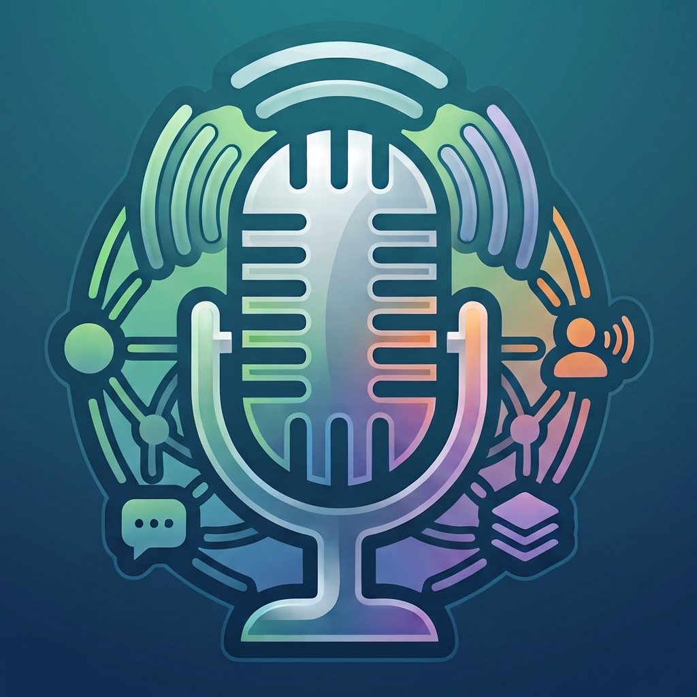
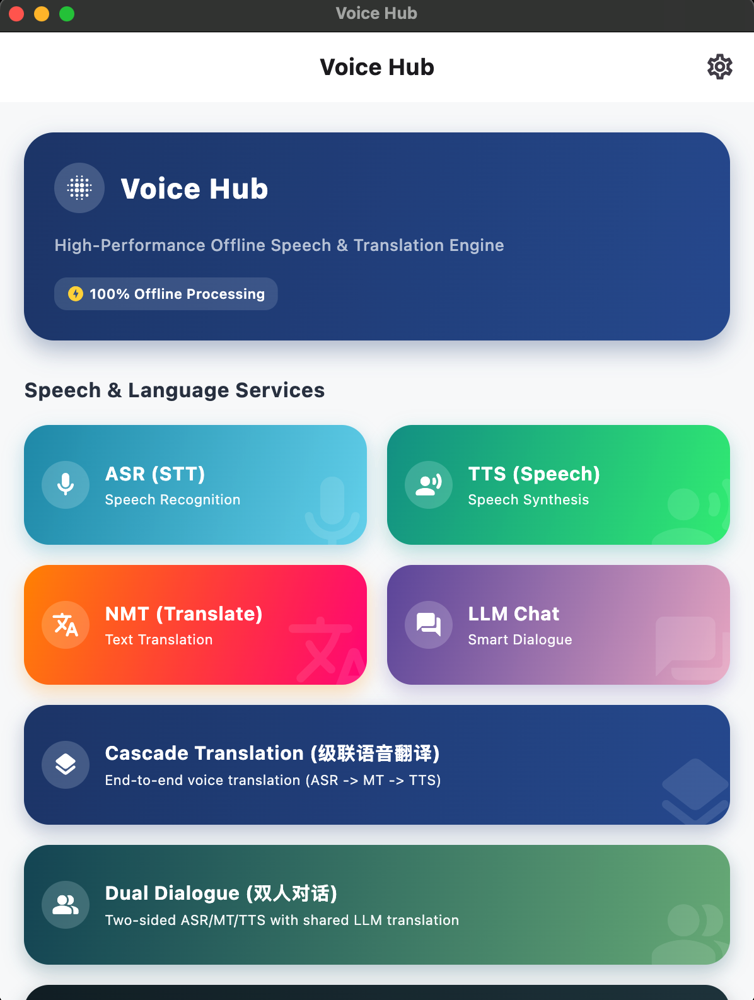
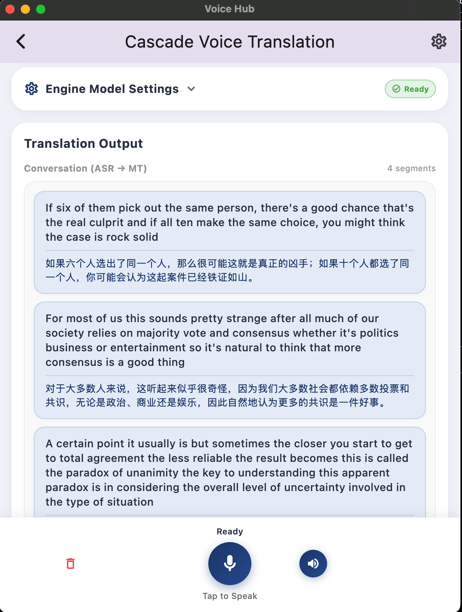
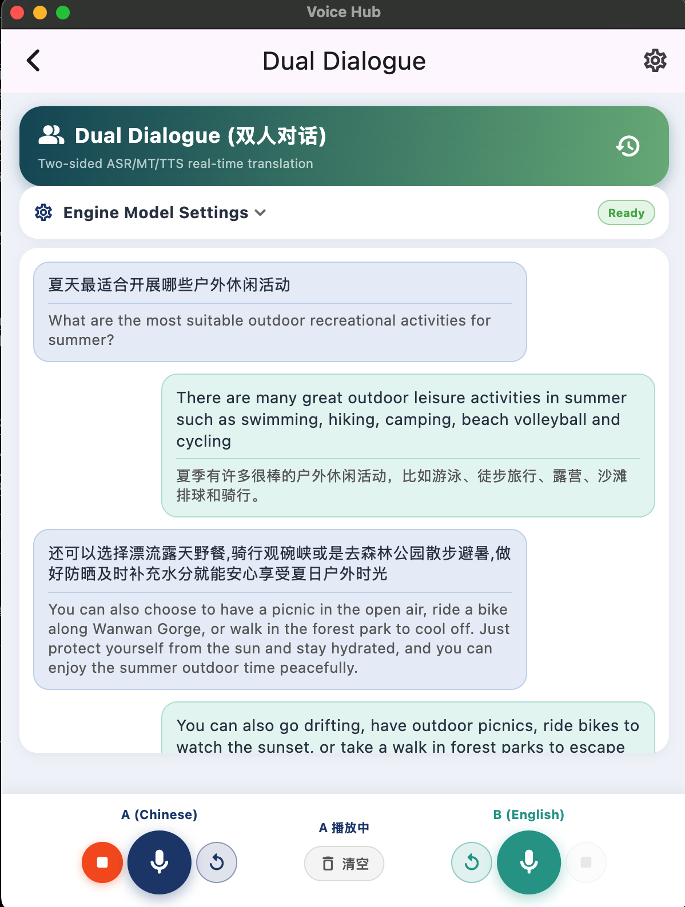
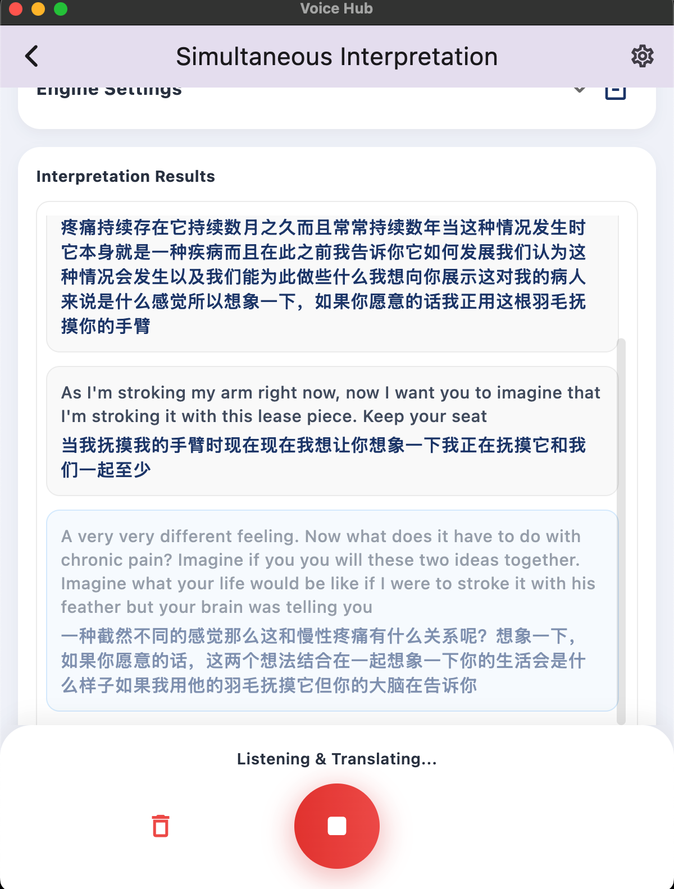
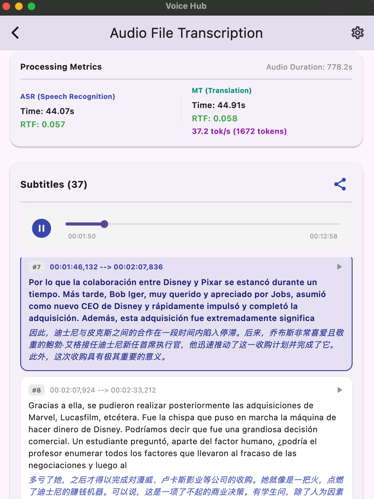
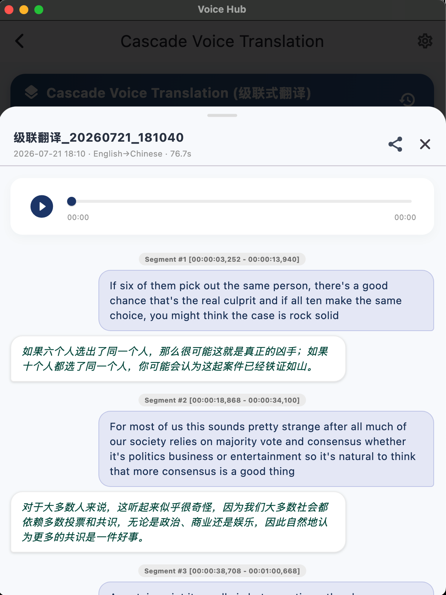

  
  <h1>VoiceHub</h1>
  
🌍 A Cross-Platform AI Voice & Translation App / 一款跨平台的端侧 AI 语音与翻译应用

---

[English](#english) | [简体中文](#简体中文)

---

<h2 id="english">🇬🇧 English</h2>

### 📖 Introduction
> **⚠️ Important Notice**: VoiceHub relies on local open-source AI models to function. Before running the app, you **must** download and configure the required models. Please refer to the [Models Setup Guide](docs/models.md) for detailed instructions.

VoiceHub is a powerful cross-platform Flutter application providing dedicated **iOS** and **macOS** apps. It integrates advanced on-device AI models for Automatic Speech Recognition (ASR), Text-to-Speech (TTS), and Neural Machine Translation (NMT), delivering a complete voice processing pipeline right on your device.

### ✨ Highlights
- ⚡ **Native C++ Engine**: Built with a focus on maximum performance, leveraging C++ native engines for lightning-fast voice processing.
- 🔒 **100% Offline & Private**: All ASR, TTS, and translation processes run completely locally. No data is sent to the cloud, ensuring absolute privacy.
- 🚀 **GPU-Accelerated LLMs**: Integrates the `llama.cpp` inference framework, allowing Large Language Models (LLMs) to run directly on the device's GPU for blazing fast translations.
- 📜 **Unified History Management**: Across all translation modes, it provides comprehensive support for automatic history saving, audio playback, precise timestamped segment comparisons, and one-click sharing.

### 🌟 Features
- 🎙️ **Real-time Speech Recognition (ASR)**: High-accuracy, offline speech-to-text processing.
- 🔊 **Text-to-Speech (TTS)**: Natural and fast offline voice generation.
- 🌐 **Neural Machine Translation (NMT)**: Powered by local LLMs (llama.cpp) and Opus-MT for high-quality, rapid text translation.
- 🔗 **Cascade Voice Translation**: A robust ASR-to-MT pipeline. Features a clean interface displaying original and translated text blocks in real-time.
- 📄 **Offline Audio File Translation**: Import audio and video files for fast, fully offline transcription and translation without size limits.
- 🗣️ **Dual Dialogue Mode**: Face-to-face real-time speech translation, designed for seamless bilingual conversations.
- 📜 **History Records & Subtitle Export**: Automatically saves transcription and translation history with support for exporting content as subtitle files.
- 🧠 **Model Management**: Built-in comprehensive manager to easily import, switch, and manage various local ONNX/GGUF AI models.
- 🔄 **Simultaneous Translation (SimulST)**: Real-time cross-language voice translation pipeline *(Note: Internal testing version, no models included)*.
  - *Cascade vs. SimulST*: Unlike the cascade approach, SimulST does not rely on an ASR model using VAD or punctuation for forced sentence segmentation. Instead, it uses an end-to-end translation model that independently determines the optimal timing to output translations, bypassing the traditional ASR dependency.
- ⚡ **Cross-Platform**: Engineered for macOS, iOS, and other platforms.
- 🔒 **Privacy First**: Fully on-device data processing, requiring no internet connection.

#### 📸 App Previews
> *Note: Replace the placeholders below with actual application screenshots.*

| Main Screen | Cascade Translation | Dual Dialogue |
|:---:|:---:|:---:|
|  |  |  |

| Simultaneous Translation | File Translation | History Records |
|:---:|:---:|:---:|
|  |  |  |

### 🧠 Model Support
VoiceHub provides extensive support for various open-source models:
- **ASR (Speech Recognition)**: Supports `transducer` architecture models released by `sherpa-onnx`.
- **TTS (Text-to-Speech)**: Supports `vits` architecture models released by `sherpa-onnx`.
- **NMT (Small Translation Models)**: Requires exporting `opus_mt` models to ONNX format.
- **LLM (Large Language Models)**: Supports open-source LLMs in the `gguf` format. We highly recommend using the **hy-mt2-1.7B** model for translation tasks.

### ⚙️ Audio & VAD Settings
During continuous audio recording, VoiceHub primarily relies on the **[silero-vad](https://github.com/snakers4/silero-vad)** model for Voice Activity Detection (VAD) and automatic sentence segmentation.
- **Dynamic Adjustments**: You can freely adjust the VAD parameters (Threshold, Min Silence, Min Speech) directly via the **Settings (⚙️) -> VAD Settings** panel in the app to optimize for your speaking pace and environment.
- **Default Recommended Settings**:
  - **General Mode** (Cascade Translation / Dual Dialogue): Speech threshold is set to `0.5`, with minimum speech and silence durations both set to `0.3` seconds (300ms) for snappy, responsive turns.
  - **SimulST Mode** (Simultaneous Translation): Minimum silence duration is increased to `0.5` seconds (500ms) to allow longer continuous speech blocks before translating.

### 🛠️ Built With (Open Source Frameworks)
VoiceHub's robust architecture is built upon several excellent open-source projects:
- **[Flutter](https://flutter.dev/)** - UI Framework
- **[sherpa-onnx](https://github.com/k2-fsa/sherpa-onnx)** - ASR & TTS engine
- **[llama.cpp](https://github.com/ggerganov/llama.cpp)** - Local LLM inference engine
- **[Opus-MT](https://github.com/Helsinki-NLP/Opus-MT)** - Neural Machine Translation framework
- **Kaldi-native-fbank** - Audio feature extraction

### 🚀 Release Versions
- **v1.0.0**: Initial release featuring core ASR, TTS, Opus-MT, and LLaMA native integrations, File Translation, and Dual Dialogue mode for macOS and iOS.

### 📚 Documentation & Tutorials
Please refer to the following documentation in the `@docs` directory for build instructions, model setup, and platform-specific guides:
- 🍎 [macOS Build & Distribution Guide](docs/macos.md)
- 📱 [iOS Build Guide](docs/ios.md)
- 🧠 [Models Setup Guide](docs/models.md)
- 🌍 [Opus-MT Setup Guide](docs/opus_mt.md)

---

<h2 id="简体中文">🇨🇳 简体中文</h2>

### 📖 简介
> **⚠️ 重要提示**：VoiceHub 的所有核心功能均依赖于本地开源 AI 模型。在运行应用之前，您**必须**先下载并配置相关模型。请务必仔细参考 [模型配置指南](docs/models.md) 进行操作。

VoiceHub 是一款强大的跨平台 Flutter 应用，目前已提供原生的 **iOS** 和 **macOS** 应用版本。它集成了先进的端侧 AI 模型，提供自动语音识别 (ASR)、文字转语音 (TTS) 以及神经机器翻译 (NMT) 等完整的语音处理能力。

### ✨ 核心亮点
- ⚡ **原生 C++ 引擎驱动**：底层基于 C++ 原生引擎构建，注重极致的性能与运行效率。
- 🔒 **100% 离线与隐私保护**：所有的语音识别、合成与翻译处理均在设备本地完成，无需网络连接，绝对保障您的数据隐私。
- 🚀 **GPU 加速的端侧大模型**：通过深度集成 `llama.cpp` 推理框架，VoiceHub 能够将大语言模型 (LLM) 直接运行在设备的 GPU 上，从而大幅加速翻译推理速度。
- 📜 **统一的历史记录管理**：在所有功能模式下，应用均提供统一的基础架构支持：自动保存历史记录、录音回放、查看带时间戳的精确分段对照以及一键分享。

### 🌟 功能详细
- 🎙️ **实时语音识别 (ASR)**：高精度的离线流式与非流式语音转文本能力。
- 🔊 **语音合成 (TTS)**：自然、极速的离线语音生成。
- 🌐 **机器翻译 (NMT)**：基于本地大语言模型 (llama.cpp) 和 Opus-MT，提供高质量的文本翻译。
- 🔗 **级联语音翻译 (Cascade Translation)**：结合 ASR 与 MT 的标准翻译流水线。界面直观展示实时双语对照翻译结果。
- 📄 **离线文件翻译**：支持导入本地音视频文件，快速进行离线语音提取、转写与翻译。
- 🗣️ **双人对话模式**：专为跨语言面对面交流设计的双语实时翻译界面。
- 📜 **历史记录与字幕导出**：自动保存所有的转写与翻译历史记录，并支持将结果一键导出为字幕文件。
- 🧠 **模型管理**：内置完善的模型管理器，支持方便地导入、管理和切换本地各类 AI 模型（支持压缩包直通导入）。
- 🔄 **同声传译 (SimulST)**：实时的跨语言语音翻译流水线 *（注：内部测试版本，无开源模型提供）*。
  - *级联 vs 同传的区别*：传统的级联翻译强依赖 ASR 模型通过 VAD 或标点符号进行强制断句。而同传 (SimulST) 则采用端到端的翻译模型，能够自主判断最优时机进行增量输出，完全不再依赖 ASR 的前置断句机制。
- ⚡ **跨平台支持**：专为 macOS、iOS 等多平台设计与深度优化。
- 🔒 **隐私优先**：完全在端侧本地处理数据，无需连接网络。

#### 📸 界面预览
> *注：请将下方的占位图替换为实际的应用截图。*

| 主界面 | 级联翻译 | 双人对话 |
|:---:|:---:|:---:|
|  |  |  |

| 同声传译 | 文件翻译 | 历史记录 |
|:---:|:---:|:---:|
|  |  |  |

### 🧠 模型支持
VoiceHub 为多种开源模型提供深度的本地推理支持：
- **ASR (语音识别)**：支持由 `sherpa-onnx` 发布的 `transducer` 架构模型。
- **TTS (语音合成)**：支持由 `sherpa-onnx` 发布的 `vits` 架构模型。
- **小模型翻译 (NMT)**：需要将 `opus_mt` 模型导出为 ONNX 格式后使用。
- **LLM (大语言模型)**：支持使用 `gguf` 格式的开源大模型。针对翻译场景，强烈推荐使用腾讯的 **hy-mt2-1.7B** 翻译大模型。

### ⚙️ 录音与 VAD 设置
在持续收音过程中，应用主要依赖于自带的 **[silero-vad](https://github.com/snakers4/silero-vad)** 模型来进行实时的语音端点检测与自动断句。
- **界面动态调节**：您可以直接在主界面的 **“设置 (⚙️)” -> “VAD 参数设置”** 面板中，通过滑动条动态调节各种 VAD 参数（语音阈值、最小静音判定时长、最少发言时长），以适应您的语速与背景噪音。
- **默认推荐参数**：
  - **通用模式 (General Mode)**：用于级联翻译和双人对话，语音阈值设为 `0.5`，最小静音 (minSilence) 和最小语音 (minSpeech) 时长均为 `0.3` 秒 (300ms)，以实现极速响应。
  - **同传模式 (SimulST Mode)**：为了收集更长、更完整的上下文，最小静音触发断句的时长被放宽至 `0.5` 秒 (500ms)。

### 🛠️ 使用到的开源框架
VoiceHub 的强大功能离不开以下优秀的开源项目：
- **[Flutter](https://flutter.dev/)** - 跨平台 UI 框架
- **[sherpa-onnx](https://github.com/k2-fsa/sherpa-onnx)** - ASR 与 TTS 引擎
- **[llama.cpp](https://github.com/ggerganov/llama.cpp)** - 用于翻译的本地 LLM 推理引擎
- **[Opus-MT](https://github.com/Helsinki-NLP/Opus-MT)** - 神经机器翻译模型
- **Kaldi-native-fbank** - 音频特征提取库

### 🚀 Release 版本
- **v1.0.0**：首发版本，包含核心 ASR、TTS、Opus-MT 以及 LLaMA 的原生集成，加入了离线文件翻译、双人对话等核心业务场景，完美支持 macOS 及 iOS 平台。

### 📚 教程与文档
关于环境搭建、编译打包和模型配置，请参考项目 `@docs` 目录下的详细教程：
- 🍎 [macOS 构建与打包指南](docs/macos.md)
- 📱 [iOS 编译指南](docs/ios.md)
- 🧠 [模型下载配置指南](docs/models.md)
- 🌍 [Opus-MT 部署指南](docs/opus_mt.md)
